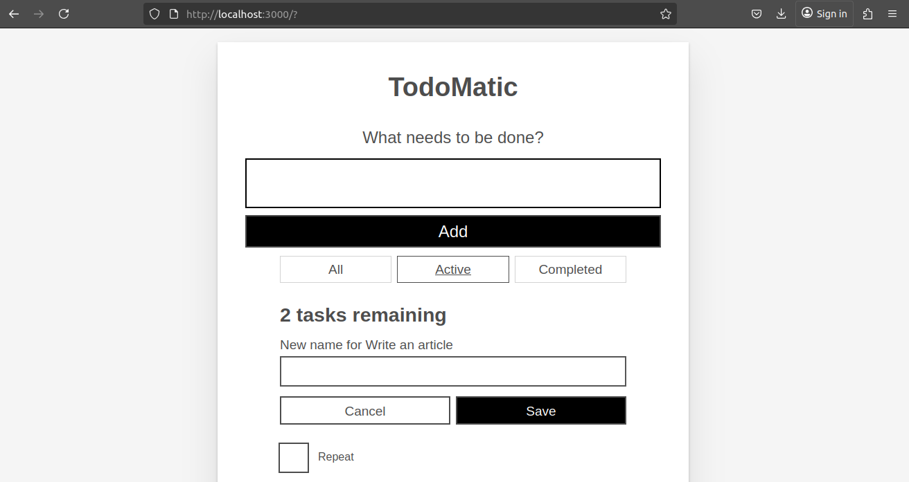

# MyToDo App




This app is created using JavaScript React. 
You can;
1. create a task, 
2. edit a task, 
3. delete a task 
4. and you can also filter the tasks. 
interactively.

## How to install

step 1: Move to a folder of you choice in your laptop. I am using Linux Operating System(Ubuntu).
```bash
cd Desktop && git clone https://github.com/GathangaElijah/reactapp.git
cd reactapp/moz-todo-react && npm install && npm run dev
```
This commands opens the app in the browser.
step 2: Ensure you have npm installed
if you dont have it installed [follow the installation process](https://docs.npmjs.com/downloading-and-installing-node-js-and-npm)

step 3: Open code editor of your choice. I am using Visual Studio Code.
